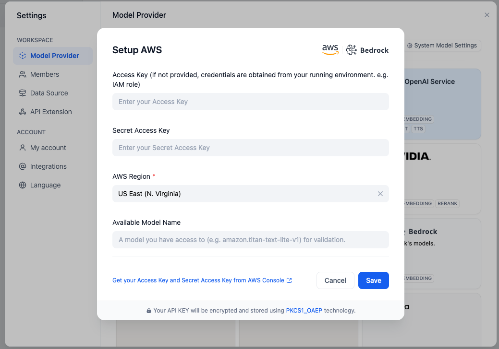

# Dify on AWS with CDK

[](https://github.com/aws-samples/dify-self-hosted-on-aws/actions/workflows/build.yml)

Self-host [Dify](https://dify.ai/), an LLM app development platform, using AWS managed services with AWS CDK.


Key Features:

* Fully managed services requiring less maintenance effort
    * Aurora servereless v2, ElastiCache, ECS Fargate, etc.
* Cost effective architectural decisions
    * allow to use NAT instances instead of NAT Gateway, and Fargate spot capacity by default
* Natively integrate with Bedrock using IAM roles

本リポジトリの使い方について、日本語で書かれた記事もあります: [AWS CDKでDifyを一撃構築](https://note.com/yukkie1114/n/n0d9c5551569f)

## Prerequisites
You must have the following dependencies installed to deploy this app:

* [Node.js](https://nodejs.org/en/download/) (v18 or newer)
* [Docker](https://docs.docker.com/get-docker/)
* [AWS CLI](https://docs.aws.amazon.com/cli/latest/userguide/getting-started-install.html) and IAM profile with Administrator policy

## Deploy
You can adjust configuration parameters such as AWS regions by modifying [`bin/cdk.ts`](bin/cdk.ts). Please also check [`DifyOnAwsStackProps` interface](./lib/dify-on-aws-stack.ts) for all the available parameters.

Then you can run the following commands to deploy the entire stack.

```sh
# install npm dependencies
npm ci
# bootstrap the AWS account (required only once per account and region)
npx cdk bootstrap
# deploy the CDK stack
npx cdk deploy
```

The initial deployment usually takes about 20 minutes. After a successful deployment, you will get the URL for the app.

```
 ✅  DifyOnAwsCdkStack

✨  Deployment time: 326.43s

Outputs:
DifyOnAwsStack.DifyUrl = https://dify.example.com
```

You can open the URL with a browser and get started!

## Tips

Here is the information that might help when you use Dify on AWS.

### Setup Dify to use Bedrock

After logged in, you can setup Dify to use Bedrock LLMs.

> [!IMPORTANT]  
> Before setting up models in Dify, you have to **enable models** you want to use in Bedrock management console. Please read [this document](https://docs.aws.amazon.com/bedrock/latest/userguide/model-access.html#model-access-add) for more details.

Go to settings by clicking the right-top profile, click `WORKSPACE -> Model Provider`, and select `AWS Bedrock model`.

IAM policies are already configured properly, so you can just select a correct AWS region (where the models are enabled) to use Bedrock models, and click `Save`.



### Add Python packages available in code execution

You can add Python packages that is available in Dify code execution feature. Edit [sandbox-python-requirements.txt](./lib/constructs/dify-services/docker/sandbox-python-requirements.txt) following the [Requirements File Format](https://pip.pypa.io/en/stable/reference/requirements-file-format/).

In some libraries, you have to allow additonal system calls in Dify sandbox. This CDK project let you to allow all the system calls by `allowAnySysCalls` flag in [`bin/cdk.ts`](bin/cdk.ts).

> [!WARNING]
> If you enable `allowAnySysCalls` flag, please make sure that code executed in your Dify tenant can be fully trusted.

Please also refer to this blog article for more details: [Using any Python libraries in Dify's code block](https://tmokmss.hatenablog.com/entry/use-any-python-packages-on-dify-sandbox)

## Clean up
To avoid incurring future charges, clean up the resources you created.

```sh
npx cdk destroy --force
# If you encountered an error during the deletion, please retry. It happens sometimes.
```

## Cost

The following table provides a sample cost breakdown for deploying this system in the us-east-1 (N. Virginia) region for one month.


| AWS service |	Dimensions |	Cost [USD] |
| --------------------| ----------------- | -------------------------------|
| RDS Aurora	| Postgres Serverless v2 (0.5ACU) |	$43.2 |
| ElastiCache	| Valkey t4g.micro |	$9.2 |
| ECS (Fargate)	| Dify-web 1 task running 24/7 (256CPU) |	$2.7 |
| ECS (Fargate)	| Dify-api 1 task running 24/7 (1024CPU) |	$10.7 |
| ECS (Fargate)	| Dify-worker 1 task running 24/7 (1024CPU) |	$10.7 |
| Application Load Balancer |	ALB-hour per month |	$17.5 |
| VPC |	NAT Instances t4g.nano x1 | 	$3.0 |
| TOTAL | estimate per month |	$97.0 |

Note that you have to pay LLM cost (e.g. Amazon Bedrock ) in addition to the above, which totally depends on your specific use case.

## Security

See [CONTRIBUTING](CONTRIBUTING.md#security-issue-notifications) for more information.

## License

This library is licensed under the MIT-0 License. See the LICENSE file. You should also check [Dify's license](https://github.com/langgenius/dify/blob/main/LICENSE).

## Acknowledgement
This CDK code is heavily inspired by [dify-aws-terraform](https://github.com/sonodar/dify-aws-terraform).
